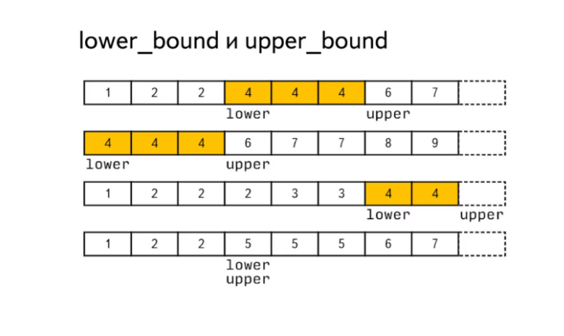

1. Первый больший или равный данному:
  `lower_bound(begin(v), end(v), x)`

2. Первый элемент, больший данного:
   `upper_bound(begin(v), end(v), x)`





3. Диапазон элементов, равных данному (аналог minmax):
```c++
	equal_range(begin(v), end(v), x) ==
	make_pair(lower_bound(...), upper_bound(...)) 
``` 
	Ещё про equal_range
	1.  Если элемент есть, то `equal_range = [lower_bound, upper_bound)`– диапазон всех вхождений;

    2. Если же элемента нет, то `lower_bound == upper_bound` – позиция, куда можно вставить
элемент без нарушения порядка сортировки;

	3.  Количество вхождений == `upper_bound - lower_bound`

	4. перебрать все элементы, равные данному, можно просто проитерировавшись от `lower_bound` до `upper_bound`.