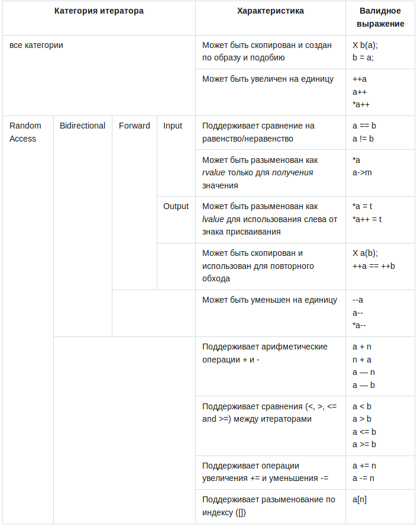

Что такое итератор? Это довольно абстрактное понятие.
- Итератор указывает (ссылается) на элемент последовательности (или
за последний элемент - end()) .
- Два итератора можно сравнивать с помощью операторов == !=
- Значение элемента, на который указывает итератор, можно полу­
чить с помощью унарного оператора * ("разыменование").
- Итератор на следующий элемент можно получить с помощью опера­
тора ++.

Begin() и end() -итераторы; они идентифицируют начало и конец
последовательности. Последовательность является тем, что называют
"полуоткрытой" ("half-open") последовательностью; иначе говоря, элемент,
идентифицированный итератором begin, является частью последователь­
ности, а итератор end указывает на ячейку, следующую за концом после­
довательности. Обычно такие последовательности (диапазоны) обознача­
ются следующим образом: [begin,end)

Основные операции над стандартными итераторами:

p=q -> Равно true тогда и только тогда, когда оба итератора, р и q, указывают на
один и тот же элемент или оба указывают за последний элемент
р ! =q ->! (p== q)
*р -> Ссылка на элемент, на которы й указывает итератор р
*p=val - > Присваивает значение val элементу, на который указывает итератор р
val=*p -> Присваивает переменной val значение элемента, на которы й указывает
итератор р
++р -> Устанавливает итератор р указывающим на следующий элемент последова­
тельности или на элемент, следующий за последним элементом последова­
тельности

Категории итераторов:

Существующая классификация итераторов насчитывает 5 категорий итераторов:
1. Input iterator(Входной) - Mожем перемещаться вперед с помощью оператора ++ и однократно считывать каждый элемент с помощью опреатора *. Истраторы сравнимы. Этот вид представляется классом istream
2. Output iterator(Выходной) - Можем перемещаться вперед с помощью оператора ++ и однократно записывать каждый элемент с помощью опреатора *. Истраторы сравнимы. Этот вид представляется классом ostream
3. Forward iterator (Однонаправленный) - Можно перемещаться многократно и использованием ++, а также считывать и записывать неконстаные элементы с помощью *. Можно использовать ->. 
4. Bidirectional iterator (Двунаправленный) - Можно перемещаться вперед и назад. А также считывать и записывать. Эти итераторы представлены в set, map, list
5. Random access iterator (Произвольного доступа) - Можно вычитать итераторы. Доступ с помощью опреатора []. Можно прибавлять произвольное целое число.  Этот вид итераторов реализован в vector 

