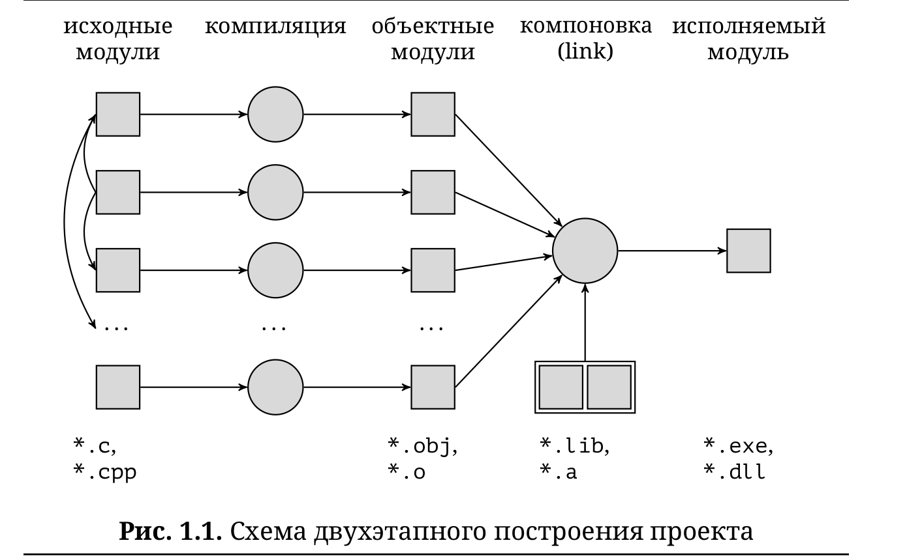

Кратко о сборке программ из нескольких файлов

В сборку входят три стадии препроцессинг, компоновка(линковка) и компиляция

В с++ есть правило ODR()One Definition Rule) - любая функция или метод класса должна быть определена только один раз 

Для его выполнения нужно все определения помещать в cpp файл

Чтобы избежать двойного включения используют #pragma once 

Разбиение программы на файлы не только упрощает понимание и переиспользование кода, но и ускоряет перекомпиляцию программы

Делать включение заголовочного файла нужно в основной программе и в программе с определениями функций, методов

Шаблонные методы должны быть обьявлены и определены в одном файле. Это связано с особенностями компилирования шаблонных методов и функций. 

Ещё раз о линковке
∙ На этапе компиляции объектных файлов в места вызова
функций подставляются имена функций.
∙ На этапе линковки в места вызова вместо имён функций
подставляются их адреса.
∙ Ошибки линковки:
1. undefined reference Функция имеет объявление, но не имеет тела.

2. multiple definition Функция имеет два или более определений. Наиболее распространённый способ получить multiple definition — определить функцию в заголовочном файле, который включён в несколько .cpp файлов.

Вся информация о структура существует только на момент компиляции, поcле информации о них нет 

