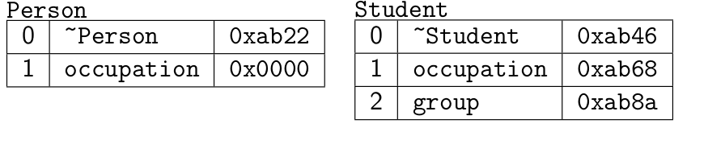

Таблица виртуальных методов

Что представляет собой таблица виртуальных функций и для чего она нужна? Таблица виртуальных функций хранит в себе адреса всех виртуальных методов класса (по сути, это массив указателей), а также всех виртуальных методов базовых классов этого класса.

Таблиц виртуальных функций у нас будет столько, сколько есть классов, содержащих виртуальные функции — по одной таблице на класс. Объекты каждого из классов содержат именно указатель на таблицу, а не саму таблицу! 

Итак, для каждого класса у нас будет создана таблица виртуальных функций. Каждой виртуальной функции базового класса присваивается подряд идущий индекс (в порядке объявления функций), по которому в последствие и будет определяться адрес тела функции в таблице VTABLE. При наследовании базового класса, производный класс «получает» и таблицу адресов виртуальных функций базового класса. Если какой-либо виртуальный метод в производном классе переопределяется, то в таблице виртуальных функций этого класса адрес тела соответствующего метода просто будет заменен на новый. При добавлении в производный класс новых виртуальных методов VTABLE производного класса расширяется, а таблица базового класса естественно остается такой же, как и была. Поэтому через указатель на базовый класс нельзя виртуально вызвать методы производного класса, которых не было в базовом — ведь базовый класс о них ничего «не знает». 


Итого:

- Динамический полиморфизм реализуется при помощи таблиц виртуальных методов.

- Таблица заводится для каждого полиморфного класса.

- Объекты полиморфных классов содержат указатель на таблицу виртуальных методов соответствующего класса.

- Вызов виртуального метода — это вызов метода по адресу из таблицы (в коде сохраняется номер метода в таблице).

```c++
struct Person {
	virtual ~ Person () {}
	string name () const { return name_ ;}
	virtual string occupation () const = 0;
...
};
struct Student : Person {
	string occupation () const { return " student " ;}
	virtual int group () const { return group_ ;}
...
};

Person *p;
p - > occupation (); // p->vptr[1]();
```



Виртуальные методы вызванные в конструкторе или деструкторе ведут себя не как вирутальные: 

```c++
struct Person {
	virtual string name () const { return name_ ;}
...
};
struct Teacher : Person {
	Teacher ( string const & nm ) : Person ( nm ) { cout << name (); }
...
};
struct Professor : Teacher {
	string name () const { return " Prof . " + name_ ;}
...
};

Professor p("Stroustrup"); // "Stroustrup"
```